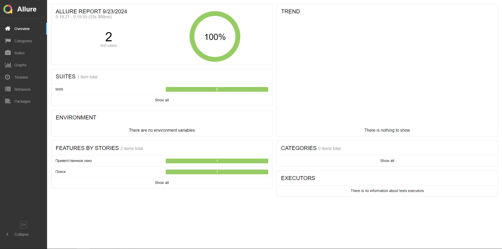
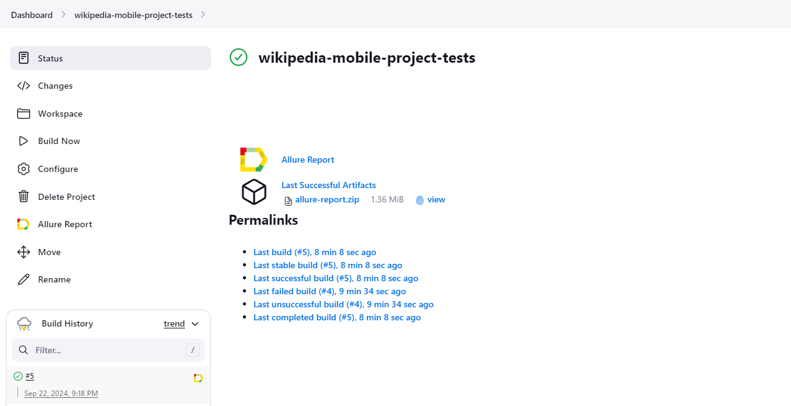
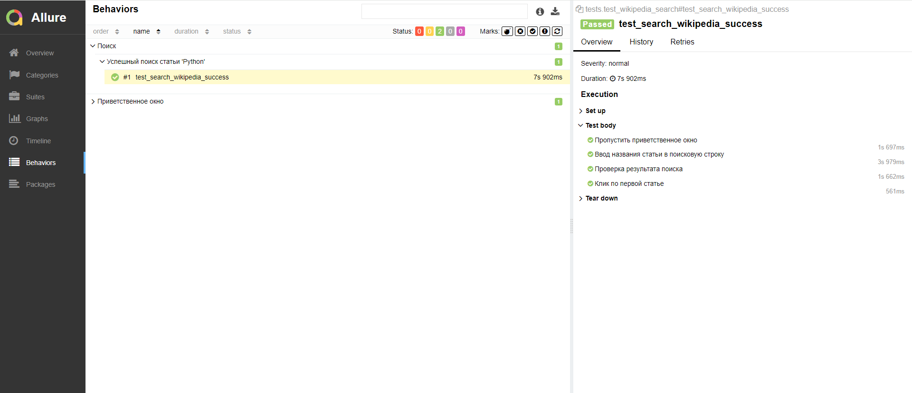
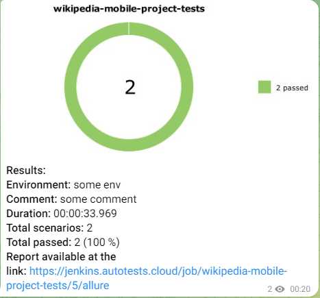

<h1 align="center"> Проект по автоматизации тест-кейсов мобильного приложения Wikipedia </h1>

## Используемые инструменты

<div>
&nbsp  
&nbsp  
&nbsp
&nbsp  
&nbsp  
&nbsp
&nbsp
&nbsp
&nbsp
</div>

## Запуск тестов и получение отчета

### **Для локального запуска тестов необходимо:**

1. Открыть Android Studio и запустить эмулятор
2. В терминале запустить Appium

<details><summary>2. Склонировать репозиторий</summary>

```
https://github.com/yulya9999/wikipedia-mobile-project-tests.git
```

</details>

<details><summary>3. Установить зависимости и запустить тесты</summary>

```
python -m venv .venv
source .venv/bin/activate
pip install -r requirements.txt
pytest --context=local_emulator  # запуск теста в контексте local_emulator
pytest --context=bstack          # запуск теста в контексте bstack
```

</details>

<details><summary>4. Получить отчет о прохождении тестов в allure</summary>

```
allure serve test/allure-results/
```

</details>

После выполнения команды откроется браузер с отчетом

<details><summary>Пример отчета</summary>



</details>

### **Для удаленного запуска тестов необходимо:**

1. Открыть [проект на Jenkins](https://jenkins.autotests.cloud/job/wikipedia-mobile-project-tests/)
2. Нажать на кнопку "Build Now" и дождаться окончания выполнения тестов

<details><summary>Пример</summary>



</details>

3. Для получения отчета о прохождении тестов
   в [Allure](https://jenkins.autotests.cloud/job/wikipedia-mobile-project-tests/5/allure/), следует нажать на
   иконку

- ***Пример отчета в Allure***



5. После прохождения тестов, в telegram придет сообщение с отчетом

<details><summary>Пример отчета в telegram</summary>



</details>


